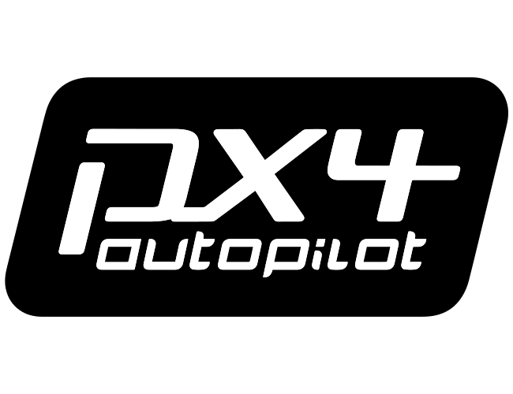

<h1 align="center">The autopilot stack the industry builds on.</h1>

  

  PX4 is an open-source autopilot stack for drones and unmanned vehicles. It supports multirotors, fixed-wing, VTOL, rovers, and many more experimental platforms, from racing quads to industrial survey aircraft.

[📖 Documentation](https://docs.px4.io/) &nbsp;•&nbsp;
[💬 Discuss](https://discuss.px4.io) &nbsp;•&nbsp;
[🎧 Discord](https://discord.gg/dronecode) &nbsp;•&nbsp;
[🤝 Contribute](https://docs.px4.io/main/en/contribute/)

---
PX4 runs on [NuttX](https://nuttx.apache.org/), Qualcomm QuRT RTOS, Linux, macOS, and Windows, and is licensed under the permissive [BSD 3-Clause](https://github.com/PX4/PX4-Autopilot/blob/main/LICENSE) license.

PX4 is hosted by the [Dronecode Foundation](https://www.dronecode.org/), a [Linux Foundation](https://www.linuxfoundation.org/) Collaborative Project. Dronecode holds all PX4 trademarks and serves as the project's legal guardian, ensuring vendor-neutral stewardship so no single company owns the name or controls the roadmap.

Code of Conduct — see [`CODE_OF_CONDUCT.md`](./CODE_OF_CONDUCT.md). &nbsp;•&nbsp; Security — report vulnerabilities via [`SECURITY.md`](./SECURITY.md).
